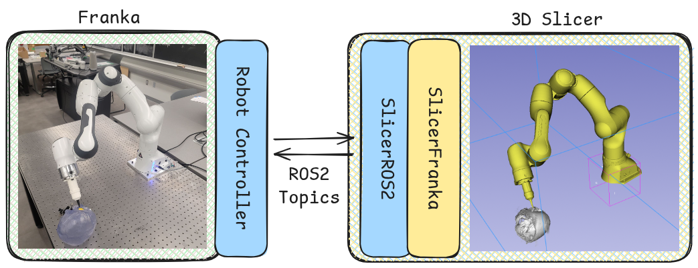

# SlicerFranka Guide

For the installation guide, refer to the [README](../README.md)

Three components share the work:

- **The SlicerFranka module** (this repo, under `SlicerFranka/`). A 3D Slicer scripted-loadable module. Manages the UI, markup-driven trajectory planning, registration workflows, and the Slicer-side robot model. It is **not** a real-time process and does no IK or joint-rate limiting on the command path.
- **The robot-side controller** (e.g. [`franka_controller`](../franka_controller)). Runs on a PREEMPT_RT-patched Linux kernel. Manages the real-time PD loop, IK, mode-specific motion generation (joint rate-limiting, Cartesian interpolation, trajectory time-parameterization via TOPP-RA), and gravity-compensation for compliant mode. Publishes measured state back to Slicer.
- **SlicerROS2.** The bridge inside Slicer. Wraps ROS 2 publishers/subscribers as MRML nodes, lets you observe inbound messages via VTK's `ModifiedEvent`, and handles the Python ↔ rclcpp boundary.

The two SlicerFranka and controller components can run on the same machine or on two networked machines — DDS handles discovery either way. Splitting them is common because Slicer needs a desktop graphical environment and the controller needs a real-time kernel, and the two requirements can be at odds.

## ROS 2 topics

This is the contract a controller must implement to be compatible with the SlicerFranka module

**Command topics (Slicer → controller)**
- `/franka/control_mode` (`std_msgs/String`): one of `joint|cartesian|trajectory|compliant`.
- `/franka/command/joint_state` (`sensor_msgs/JointState`): absolute joint targets.
- `/franka/command/tip_pose` (`geometry_msgs/PoseStamped`): absolute tip-pose targets.
- `/franka/trajectory/waypoint` (`geometry_msgs/PoseStamped`): buffered tip-pose waypoints.
- `/franka/trajectory/command` (`std_msgs/String`): `clear|start|cancel`.

**Feedback topics (controller → Slicer)**
- `/franka/current/joint_state` (`sensor_msgs/JointState`).
- `/franka/current/tip_pose` (`geometry_msgs/PoseStamped`).
- `/franka/trajectory/status` (`std_msgs/String`): `idle|buffering|executing|done|canceled|error`.

**Visualization-only**
- `/franka/slicer/joint_state` (`sensor_msgs/JointState`): feeds the Slicer-side `robot_state_publisher`. See the design note below, it isn't the same as `/franka/current/joint_state`.

## Design decisions

### Control modes enable four behaviors

The four control tabs map to robot-side modes via a single string topic, `/franka/control_mode`. When the robot is not executing a `trajectory`, it could be controlled in `joint` or `cartesian` space. Or it could be totally `compliant`, allowing the user to hand-guide the end-effector, collecting points for registration.
With the controller in compliant mode, the user hand-guides the tip to physical fiducials and clicks "Add control point". The current measured tip position is appended to the `p_frame` or `q_frame` markup node. Model-space points are picked manually in Slicer. Registration itself uses Slicer's Fiducial Registration module; no points are sent over ROS.

### Coordinate frames and units

The Slicer-side robot model and the physical robot share the Franka base frame, so commanded and measured tip poses round-trip without a Slicer-side transform. Two boundary notes:

- The Cartesian UI is mm/deg (RPY). Outgoing tip-pose commands convert RPY → rotation matrix → quaternion (`PoseStamped`); inbound `tip_pose` arrives as a 4×4 matrix that `_tip_pose_callback` decomposes back to RPY via `asin`/`atan2` with an explicit gimbal-lock branch, then wraps roll/yaw to `[0, 2π)` to match the UI's convention.
- SlicerROS2 handles Slicer↔ROS unit conversions at the MRML node boundary; the module code works in Slicer units.

### Tool-tip offset

The pen/probe extension added to the flange is not in the URDF and is not knowable a priori. The open-source controller reads a flange-to-tip transform from its YAML config (`flange_to_tip_translation_m`, `flange_to_tip_quaternion_xyzw`) and applies it to both commanded and reported tip poses, so the topics describe the physical drawing point rather than the flange. Measure the pen length once and set the value. In our lab we additionally run a one-time pivot calibration (algebraic sphere-fitting) to populate this offset, but that calibration step is not part of this release. This is entirely controller-side — the module does not know or care about the offset.

## End-to-end: a trajectory from click to measured state

1. User picks a positions markup (fiducials or curve) and optionally an orientations markup, then clicks **Publish Markups** on the Trajectory tab.
2. `widget` calls `SlicerFrankaLogic.start_trajectory()`, which delegates to `TrajectoryPlanner` to assemble `(position, rotation)` waypoints.
3. `logic` publishes the trajectory protocol: `/franka/trajectory/command` = `clear`, each waypoint on `/franka/trajectory/waypoint`, then `/franka/trajectory/command` = `start`.
4. The controller buffers, runs IK on each waypoint, fits the joint-space path, time-parameterizes via TOPP-RA, and drives the PD loop. It publishes measured joints on `/franka/current/joint_state`, measured tip pose on `/franka/current/tip_pose`, and status transitions on `/franka/trajectory/status`.
5. SlicerROS2 fires `ModifiedEvent` on each inbound message. `_joint_state_callback` mirrors the joints into `/franka/slicer/joint_state` (driving the Slicer model); `_tip_pose_callback` updates the EE marker and the Cartesian display; `_trajectory_status_callback` updates the UI status indicator.
6. **Cancel** publishes `/franka/trajectory/command` = `cancel`. The controller interrupts and reports `canceled`.

### Trajectory parameterized by the controller, not Slicer

Slicer publishes discrete waypoints; the controller does the rest. Concretely the controller runs each waypoint through IK, fits a piecewise-polynomial joint-space path, applies TOPP-RA for time-optimal parameterization under joint velocity/acceleration limits, and discretizes for the PD loop.
